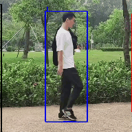
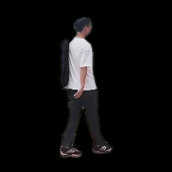
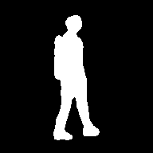

<div align="center"></div>

🎉🎉🎉 **[*OpenGait*](https://arxiv.org/pdf/2211.06597.pdf) has been accpected by CVPR2023 as a highlight paper！** 🎉🎉🎉

All-in-One-Gait is a sub-project of [OpenGait](https://github.com/ShiqiYu/OpenGait) provided by [Shiqi Yu Group](https://faculty.sustech.edu.cn/yusq/) that develops a gait recognition system.

The workflow of All-in-One-Gait primarily involves the processes of pedestrian tracking, segmentation and recognition.

Users are encougraed to update the gait recognition models with watching the lastest SOTA methods in [OpenGait](https://github.com/ShiqiYu/OpenGait).

## Demo Results

<div align="center">
        
       
        
</div>
The participants shown in the left video are gallery subjects, and that of other two videos are probe subjects. 

The recognition results are represented by the color of the bounding boxes.
<!-- The videos in `./output/demo_video_result` are all generated by main.py, where `gallery.mp4` is the gallery, and the other `probe-After.mp4` are the result videos after gait recognition. **Among them, people with the same ID are those with the same bounding box color**. -->

## How to use

### A. Run on the host machine

#### Step1. Installation
```
git clone https://github.com/ssb03/aiog_gait_system.git
cd aiog_gait_system
pip install -r requirements.txt
pip install yolox
```
#### Step2. Get checkpoints
```
demo
   |——————checkpoints
   |        └——————bytetrack_model
   |        └——————gait_model
   |        └——————seg_model
   └——————libs
   └——————output


checkpoints
   |——————bytetrack_model
   |        └——————bytetrack_x_mot17.pth.tar
   |        └——————yolox_x_mix_det.py
   |
   └——————gait_model
   |        └——————xxxx.pt
   └——————seg_model
            └——————human_pp_humansegv2_mobile_192x192_inference_model_with_softmax
```

##### Get the checkpoint of gait model

```
cd aiog_gait_system/OpenGait/demo/checkpoints
mkdir gait_model
cd gait_model
wget https://github.com/ShiqiYu/OpenGait/releases/download/v2.0/pretrained_grew_gaitbase.zip
unzip -j pretrained_grew_gaitbase.zip

```

##### Get the checkpoint of tracking model
```
cd aiog_gait_system/OpenGait/demo/checkpoints/bytetrack_model
pip install --upgrade --no-cache-dir gdown
gdown https://drive.google.com/uc?id=1P4mY0Yyd3PPTybgZkjMYhFri88nTmJX5
```

Alternatively, you can manually download the checkpoint file and put it into the folder of `bytetrack_model`.

- bytetrack_x_mot17 [[google]](https://drive.google.com/file/d/1P4mY0Yyd3PPTybgZkjMYhFri88nTmJX5/view?usp=sharing), [[baidu(code:ic0i)]](https://pan.baidu.com/s/1OJKrcQa_JP9zofC6ZtGBpw)

##### Get the checkpoint of segment model
```
cd aiog_gait_system/OpenGait/demo/checkpoints
mkdir seg_model
cd seg_model
wget https://paddleseg.bj.bcebos.com/dygraph/pp_humanseg_v2/human_pp_humansegv2_mobile_192x192_inference_model_with_softmax.zip
unzip human_pp_humansegv2_mobile_192x192_inference_model_with_softmax.zip
```

#### Step3. Run demo
```
cd aiog_gait_system/OpenGait
python demo/libs/main.py
```

All-in-One-Gait mainly consists of three processes, i.e., pedestrian tracking, segmentation, and recognition. 
In the `main.py`, you need to give two video as inputs and specify one as the gallery and other one as the probe to obtain the recognized results. 
<!-- In 1main.py, you need to select two video inputs and specify one as the gallery and one as the probe to obtain the recognized results.  -->
The return results will be written into the path of `aiog_gait_system/OpenGait/demo/output/Outputvideos/track_vis/{timestamp}` in default.

#### Step4. See the result

```
cd aiog_gait_system/OpenGait/demo/output

output
   └——————GaitFeatures: This stores the corresponding gait features
   └——————GaitSilhouette: This stores the corresponding gait silhouette images
   └——————InputVideos: This is the folder where the input videos are put
   |       └——————gallery.mp4
   |       └——————probe1.mp4
   |       └——————probe2.mp4
   |       └——————probe3.mp4
   |       └——————probe4.mp4
   └——————OutputVideos
           └——————{timestamp}
                   └——————gallery.mp4
                   └——————G-gallery_P-probe1.mp4
                   └——————G-gallery_P-probe2.mp4
                   └——————G-gallery_P-probe3.mp4
                   └——————G-gallery_P-probe4.mp4
```

**{timestamp}**: Store the result video of tracking here, naming it consistent with the input video. In addition, videos named like G-{gallery_video_name}_P-{probe_video_name}.mp4 are obtained after gait recognition.

## Authors

**OpenGait Team (OGT)**

- [Dongyang Jin(金冬阳)](https://faculty.sustech.edu.cn/?p=176498&tagid=yusq&cat=2&iscss=1&snapid=1&go=1&orderby=date), 11911221@mail.sustech.edu.cn
- [Chao Fan (樊超)](https://faculty.sustech.edu.cn/?p=128578&tagid=yusq&cat=2&iscss=1&snapid=1&orderby=date), 12131100@mail.sustech.edu.cn
- [Rui Wang(王睿)](https://faculty.sustech.edu.cn/?p=161705&tagid=yusq&cat=2&iscss=1&snapid=1&go=1&orderby=date), 12232385@mail.sustech.edu.cn
- [Chuanfu Shen (沈川福)](https://faculty.sustech.edu.cn/?p=95396&tagid=yusq&cat=2&iscss=1&snapid=1&orderby=date), 11950016@mail.sustech.edu.cn
- [Junhao Liang (梁峻豪)](https://faculty.sustech.edu.cn/?p=95401&tagid=yusq&cat=2&iscss=1&snapid=1&orderby=date), 12132342@mail.sustech.edu.cn

## Acknowledgement
- Gait Recognition: [OpenGait](https://github.com/ShiqiYu/OpenGait)
- Pedestrian Tracking: [ByteTrack](https://github.com/ifzhang/ByteTrack)
- Pedestrian Segementation: [PaddleSeg](https://github.com/PaddlePaddle/PaddleSeg)

## Citation
```
@InProceedings{Fan_2023_CVPR,
    author    = {Fan, Chao and Liang, Junhao and Shen, Chuanfu and Hou, Saihui and Huang, Yongzhen and Yu, Shiqi},
    title     = {OpenGait: Revisiting Gait Recognition Towards Better Practicality},
    booktitle = {Proceedings of the IEEE/CVF Conference on Computer Vision and Pattern Recognition (CVPR)},
    month     = {June},
    year      = {2023},
    pages     = {9707-9716}
}
```

**Note:**
This code is only used for **academic purposes**, people cannot use this code for anything that might be considered commercial use.
